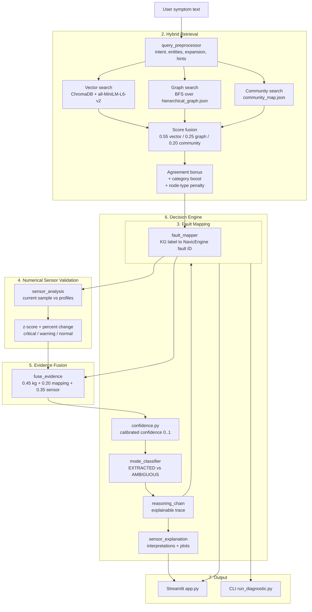

# Root-Cause Analysis of Vehicle Failures Using Agentic and Knowledge Graphs

An explainable, data-grounded vehicle fault diagnosis system that combines a **hierarchical knowledge graph**, **hybrid retrieval** (vector + graph + community search), a **calibrated confidence/decision engine**, and **statistical sensor validation** on real ECU data from the NavicEngine diesel dataset. The result is surfaced through a Streamlit assistant that either returns a high-confidence diagnosis or explicitly asks for more information — never guessing.

```
Symptom text ──► KG retrieval ──► hybrid fusion ──► confidence score ──► decision engine
                                             ▲
                      numerical sensor validation (NavicEngine ECU data)
```

---

## Overview & Motivation

Automotive fault diagnosis is dominated by free-text symptom reports: "brake pedal feels spongy", "check engine light, rough idle". These reports are ambiguous, incomplete, and noisy. Rule-based systems fail on paraphrases; pure LLM systems hallucinate plausible-sounding but unverifiable diagnoses; keyword search ignores the semantic and structural relations between symptoms, causes, and systems.

This project treats diagnosis as an **evidence-accumulation problem**:

1. **A knowledge graph** encodes the automotive fault domain (systems → subcategories → symptoms → causes → diagnosis steps) extracted from a curated fault corpus.
2. **Hybrid retrieval** pulls candidate faults using three complementary signals — dense embeddings (ChromaDB), structural graph traversal (BFS), and community structure (Louvain community detection) — and fuses them with provenance-preserving scores.
3. **A calibrated confidence engine** converts raw retrieval scores into a meaningful probability-like confidence and decides whether the evidence is strong enough to diagnose.
4. **Numerical sensor validation** grounds the linguistic diagnosis in real ECU signals. Statistical profiles built from the NavicEngine diesel dataset let the system check whether the observed sensor values actually match the suspected fault condition.
5. **Deterministic, explainable output** — every diagnosis carries a reasoning chain, and the system refuses to answer when evidence is too weak.

The core design rule: **never hallucinate**. If confidence is below threshold, the system says so and asks for more detail (optionally augmented by a local LLM whose output is clearly labelled AI-assisted and non-authoritative).

---

## Key Features

- **Two operating modes** — `EXTRACTED` (confident diagnosis, confidence ≥ 0.30) and `AMBIGUOUS` (insufficient evidence, needs more information).
- **Three-path hybrid retrieval** — dense vector search (`all-MiniLM-L6-v2` via ChromaDB), stemmed BFS graph traversal over the hierarchical KG, and community-guided search; scores fused with agreement bonuses and per-node-type calibration.
- **Calibrated confidence** — `0.60 × retrieval + 0.20 × separation + 0.20 × coverage (+ sensor boost)` against a measured retrieval reference, not a raw similarity score.
- **Numerical sensor validation** — fault candidates are mapped to NavicEngine fault IDs; live/simulated ECU samples are compared against statistical profiles (z-score, percent change) and classified into critical / warning / normal sensors.
- **Evidence fusion** — per-candidate final scores combine KG, mapping, and sensor evidence with explicit weights.
- **Explainability** — a step-by-step reasoning chain (Query Analysis → KG Retrieval → Fault Mapping → Confidence Calculation → Mode Determination), plain-English summaries, inspection steps, and per-sensor interpretations with boxplot/histogram visualizations.
- **Optional local LLM** — AI-assisted analysis via Ollama (`llama3.1:8b`) with deterministic template fallback when no LLM is available.
- **Two front ends** — a full Streamlit assistant (`app.py`) and a CLI (`run_diagnostic.py`).
- **Reproducible data artifacts** — graphs, embeddings, ChromaDB collection, statistical profiles, and comparisons are pre-built and committed, so a fresh clone runs without rebuilding.

---

## Architecture



### End-to-End Pipeline

1. **Query Preprocessing** (`num_pipeline/scripts/pipeline/query_preprocessor.py`)
   Splits the free-text report into intent, detected KG entities, expansion terms, retrieval hints (communities/categories), and expected sensors. Uses a minimal self-contained stemmer, with an optional `rapidfuzz` upgrade for fuzzy entity matching.

2. **Hybrid Retrieval** (`num_pipeline/scripts/pipeline/hybrid_retrieval.py`)
   - **Vector path** — embeds the query *and* all preprocessor-expanded queries, runs multi-query search in the persistent ChromaDB collection (`data/chroma_db`, collection `automotive_kg`, model `all-MiniLM-L6-v2`), and max-pools per-node scores.
   - **Graph path** — finds seed nodes by stemmed label overlap, then expands with BFS up to 1 hop through the hierarchical graph (`data/processed/hierarchical_graph.json`).
   - **Community path** — scores nodes within the preprocessor-predicted communities from `graphify-out/community_map.json`.
   Each path is normalized independently, then fused (weights 0.55 / 0.25 / 0.20) with a path-agreement multiplier (1.0–1.25), a category-hint boost (×1.08), node-type penalties (Symptoms/Faults favoured over generic Categories), and semantic de-duplication.

3. **Fault Mapping** (`num_pipeline/scripts/pipeline/fault_mapper.py`)
   Bridges the linguistic KG labels to NavicEngine fault IDs (e.g. *Engine misfires* → `FAULT_INJ_PRS`) via stemmed-token Jaccard overlap over fault names and categories, reporting a mapping confidence per link.

4. **Numerical Sensor Validation** (`num_pipeline/scripts/sensor_validation/`)
   For each mapped fault, the current ECU sample (uploaded CSV, or a simulated row from the matching fault-condition CSV) is compared with pre-built statistical profiles. Each sensor is flagged `CRITICAL`, `WARNING`, or `NORMAL` based on z-score and percent change, and a per-fault `sensor_confidence` is produced. Skipped cleanly when no sensor data is provided.

5. **Evidence Fusion** (`num_pipeline/scripts/pipeline/evidence_fusion.py`)
   Per candidate: `final_score = 0.45 × kg + 0.20 × mapping + 0.35 × sensor`, with the KG term normalized over the observed [0, 2.0] range.

6. **Decision Engine** (`num_pipeline/scripts/decision_engine/`)
   - `confidence.py` — calibrated confidence:
     `confidence = 0.60 × calibrate_retrieval(top) + 0.20 × separation + 0.20 × coverage + sensor_boost`, where `calibrate_retrieval` linearly maps the raw fusion score against `CALIBRATION_REFERENCE = 0.55`, `separation` is the relative lead of #1 over #2, `coverage` is the fraction of original symptom words matched by detected entities, and `sensor_boost ∈ [0, 0.05]` requires sensor confidence ≥ 0.70. Result is capped at 1.0.
   - `mode_classifier.py` — `EXTRACTED` when confidence ≥ `THRESHOLD_EXTRACTED = 0.30`, otherwise `AMBIGUOUS`; selects up to `MAX_DISPLAY = 5` candidates within the mode's confidence band.
   - `reasoning_chain.py` — builds an explainable trace: Query Analysis → Knowledge Graph Retrieval → Fault Mapping → Confidence Calculation → Mode Determination; AMBIGUOUS reports add a Symptom Gap Analysis step.
   - `explanation.py` — plain-English diagnosis summary, brief summary, and recommended inspection steps from deterministic templates, with optional AI-assisted analysis via Ollama.
   - `sensor_explanation.py` — presentation-only enrichment layer that maps sensor codes to human-readable interpretations (from `data/processed/sensor_dictionary.json`) and resolves boxplot/histogram paths for flagged sensors.

7. **Output** — `app.py` (Streamlit) and `run_diagnostic.py` (CLI) both consume a single `DiagnosticReport` object.

---

## Repository Structure

```
.
├── app.py                              # Streamlit vehicle fault diagnosis assistant
├── requirements.txt                    # Python dependencies
├── data/                               # Root-level KG assets (older build outputs)
│   ├── corpus/                         #   curated automotive fault markdown corpus
│   ├── processed/                      #   hierarchical_graph.json + gpickle
│   └── chroma_db/                      #   persistent ChromaDB collection
│
├── scripts/                            # Earlier KG build pipeline (superseded)
│   ├── 01_json_to_markdown.py
│   ├── 02_normalize_graph.py
│   ├── 03_build_embeddings.py
│   └── pipeline/hybrid_retrieval.py
│
├── num_pipeline/                       # ← ACTIVE working pipeline
│   ├── data/
│   │   ├── raw/                        #   fault JSON + INCA ECU xlsx files
│   │   ├── processed/                  #   hierarchical graph, community map,
│   │   │                               #   sensor_mapping.json, sensor_dictionary.json,
│   │   │                               #   INCA CSV exports
│   │   └── chroma_db/                  #   persistent ChromaDB
│   ├── graphify-out/                   #   community_map.json (community search)
│   ├── outputs/
│   │   ├── eda/                        #   per-condition summary stats, correlation,
│   │   │                               #   variance ranking, histograms, boxplots
│   │   ├── profiles/                   #   statistical profiles (INCA_SPEED_*_*.json)
│   │   └── comparisons/                #   t-test / Cohen's d comparisons
│   └── scripts/
│       ├── run_diagnostic.py           #   CLI wrapper (new decision engine)
│       ├── run_pipeline.py             #   legacy pipeline wrapper
│       ├── build_kg.py                 #   KG builder (graph + embeddings + communities)
│       ├── 02_normalize_graph.py, 03_build_embeddings.py
│       ├── pipeline/                   #   query_preprocessor, hybrid_retrieval,
│       │                               #   fault_mapper, evidence_fusion, llm_provider,
│       │                               #   reasoning_engine, explanation_generator (legacy)
│       ├── sensor_validation/          #   load_data, preprocess, eda, build_profiles,
│       │                               #   compare_profiles, sensor_mapping, sensor_analysis,
│       │                               #   current_sample
│       └── decision_engine/            #   engine, confidence, mode_classifier,
│                                       #   reasoning_chain, explanation, sensor_explanation
│
├── kg_decision_pipeline/               # Legacy graphify decision pipeline
│                                       #   (old 3-mode EXTRACTED/INFERRED/AMBIGUOUS +
│                                       #   community expander + Ollama fallback)
├── vehicle-fault-kg/                   # Research / thesis workspace
│                                       #   (older copies + thesis chapter)
├── data-sources/NavicEngine/           # NavicEngine dataset provenance & docs
├── tests/                              # pytest unit tests for the decision engine
├── evaluate_pipeline.py                # batch evaluation over ~37 natural-language queries
└── analysis_batch.py                   # confidence-component breakdown per query
```

### Legacy components

- `kg_decision_pipeline/` implements an earlier **three-mode** design (`EXTRACTED` / `INFERRED` / `AMBIGUOUS`) with a graphify community expander and an Ollama answer generator. It is superseded by `num_pipeline/scripts/decision_engine/`, which collapses to two modes (see Design Rationale). `vehicle-fault-kg/` contains older copies of the same stages plus the thesis chapter describing the Vehicle-Fault-KG architecture.

---

## Two Operating Modes

| Mode | Condition | Meaning | System behaviour |
|------|-----------|---------|------------------|
| **EXTRACTED** | confidence ≥ 0.30 | High-confidence diagnosis supported by retrieval, coverage, and optionally sensor data | Shows the top + related candidates (max 5) with KG context chains, sensor badges, interpretation narrative, and recommended inspection steps. |
| **AMBIGUOUS** | confidence < 0.30 | Insufficient evidence for a clear diagnosis | Explicitly states more information is needed, offers a clarification form to re-run with added details, or an AI-assisted analysis. |

Thresholds and band selection live in `num_pipeline/scripts/decision_engine/mode_classifier.py` (`THRESHOLD_EXTRACTED = 0.30`, `MAX_DISPLAY = 5`).

---

## Numerical Sensor Validation

The linguistic diagnosis is cross-checked against real signals from the **NavicEngine** diesel engine fault dataset (see `data-sources/NavicEngine/README.md`):

- **Engine**: 6-cylinder 7.6L DT diesel with dual-staged turbocharger and electro-hydraulic injectors.
- **Conditions**: four engine speeds (1000–1600 RPM) × nominal + three injected faults (`INJ_DUR`, `INJ_PRS`, `SOI`), captured as INCA ECU save-files.
- **Sensor dictionary**: `data/processed/sensor_dictionary.json` documents all 37 sensor variables with units, subsystems, and interpretation confidence.

The validation stack (`num_pipeline/scripts/sensor_validation/`) works as follows:

1. `preprocess.py` / `load_data.py` — load and clean the ECU CSVs.
2. `eda.py` — per-condition EDA: summary statistics, dataset report, correlation matrix, variance ranking, histograms, and boxplots into `outputs/eda/`.
3. `build_profiles.py` — builds per-speed/condition statistical profiles (`outputs/profiles/*.json`) with mean, std, min/max, median, quartiles, IQR, skewness, and kurtosis.
4. `compare_profiles.py` — Welch's t-test + Cohen's d between fault and nominal conditions into `outputs/comparisons/`.
5. `sensor_mapping.py` — distils significant sensors into `data/processed/sensor_mapping.json` (top 10 per fault, p < 0.05, effect size ≥ 0.8), the fault→sensor dictionary used at runtime.
6. `sensor_analysis.py` — at diagnosis time, compares the current sample against the profiles, flags critical/warning/normal sensors, and produces per-fault `sensor_confidence`.

In the UI, flagged sensors get a grounded interpretation narrative plus the pre-rendered nominal boxplot/histogram with the observed value overlaid numerically (current reading, nominal mean, deviation, % change, z-score).

---

## Getting Started

### Prerequisites

- **Python 3.10+** (tested on 3.14; 3.10–3.12 recommended for the ML stack).
- ~2 GB disk for PyTorch; the `sentence-transformers` model downloads on first run (~90 MB).
- **Optional**: [Ollama](https://ollama.com) with `llama3.1:8b` pulled, for AI-assisted analysis. The system degrades gracefully to deterministic templates without it.

> **Note on Neo4j and `.env`**: `requirements.txt` still lists `neo4j>=5.0.0` for historical reasons. The current pipeline is **fully file-based** — the knowledge graph lives in JSON (`hierarchical_graph.json`), the embeddings in a persistent local ChromaDB (`data/chroma_db`), and community structure in `community_map.json`. **No Neo4j server, no ChromaDB service, and no `.env`/API keys are required.**

### Install

```bash
git clone <repo-url>
cd Root-Cause-Analysis-of-Vehicle-Failures-Using-Agentic-and-Knowledge-Graphs

python -m venv .venv

# Windows
.venv\Scripts\activate
# macOS / Linux
source .venv/bin/activate

pip install --upgrade pip
pip install -r requirements.txt
```

All data artifacts (graphs, ChromaDB collection, profiles, comparisons) are committed, so no rebuild step is needed to run the system.

### Run the Streamlit app

```bash
streamlit run app.py
# or:  python -m streamlit run app.py
```

In the sidebar you can pick the engine speed (1000–1600 RPM) and the sensor-data source: **Simulated (from the knowledge graph)**, **Upload ECU CSV** (a real INCA save-file row), or **None** (skip sensor validation).

### Run from the CLI

```bash
# From the repository root
python num_pipeline/scripts/run_diagnostic.py "brake pedal feels spongy"
python num_pipeline/scripts/run_diagnostic.py "engine overheating" --no-sensor
python num_pipeline/scripts/run_diagnostic.py "check engine light, rough idle" --use-llm -v
python num_pipeline/scripts/run_diagnostic.py "harsh shift from 2nd to 3rd" --json --speed 1400
```

Flags: `--no-sensor` (skip sensor analysis), `--use-llm` (attempt Ollama explanations), `--speed` (1000/1200/1400/1600), `-v`/`--verbose`, `--json`.

### Run the tests

```bash
python -m pytest tests -q
```

The suite covers the calibrated confidence components, mode classification and threshold-band selection, reasoning-chain structure, and explanation templates (deterministic paths only — no LLM required).

### Batch evaluation

```bash
python evaluate_pipeline.py
```

Runs ~37 natural-language queries spanning engine, brakes, transmission, fuel, cooling, electrical, exhaust, and vague/edge cases, printing per-query mode/confidence/sensor status and aggregated statistics.

---

## Sample Diagnostic Workflow

Using the CLI with the default simulated sensor sample (real output, `engine misfires at idle`):

```text
$ python num_pipeline/scripts/run_diagnostic.py "Engine misfires at idle"

============================================================
Mode: EXTRACTED
Confidence: 97%
============================================================
Diagnosis: Engine misfires (FAULT_INJ_PRS)
```

What happens under the hood for this query:

1. **Preprocess** — detects the *engine misfire* symptom, hints the *Engine Components* community, and expands the query with related graph terms.
2. **Hybrid retrieval** — vector search finds the misfire symptom; graph BFS confirms it inside the engine community; the two paths agree, so the candidate receives the vector+graph agreement multiplier, landing near the practical retrieval ceiling (~`CALIBRATION_REFERENCE = 0.55`).
3. **Fault mapping** — the label *Engine misfires* stem-matches the anchor `engine misfires` → `FAULT_INJ_PRS` (mapping confidence 1.0).
4. **Sensor validation** — a representative row from `INCA_SPEED_1000_FAULT_INJ_PRS.csv` is compared against the statistical profiles: `FAULT_INJ_PRS` and `FAULT_SOI` confirm at `sensor_confidence` 0.90 / 0.95, comfortably above the 0.70 boost threshold; `FAULT_INJ_DUR` stays at 0.69.
5. **Fusion + decision** — fused candidates are ranked (0.45·kg + 0.20·mapping + 0.35·sensor); calibrated confidence ≥ 0.30 → `EXTRACTED`. The reasoning chain records every intermediate value for inspection.
6. **Explanation** — template-driven summary, inspection steps, and — in the UI — per-sensor interpretations with nominal boxplot/histogram overlays.

A vague query such as *"my car is broken help"* produces no matching entities and near-zero coverage → confidence ≈ 0.04 → `AMBIGUOUS`, prompting the user for more detail instead of fabricating a diagnosis.

> **Note on coverage:** the `LABEL_TO_NAVIC` / `CATEGORY_MAP` tables in `fault_mapper.py` currently cover the three NavicEngine injection faults (`FAULT_INJ_DUR`, `FAULT_INJ_PRS`, `FAULT_SOI`). Engine/fuel/exhaust queries therefore get full sensor validation, while other systems (brakes, transmission, cooling, electrical) still diagnose from KG evidence alone and report `No Evidence` for sensors.

---

## Architectural Decisions & Design Rationale

- **Two modes instead of three.** An earlier design (`kg_decision_pipeline/`) used `EXTRACTED` / `INFERRED` / `AMBIGUOUS`. A dedicated analysis (`_audit_2mode.py`) over the full evaluation query set showed the `INFERRED` band overlaps both neighbours in the confidence range — it is a bridge, not a distinct state — so it was collapsed into `EXTRACTED` (≥ 0.30) / `AMBIGUOUS`. This simplifies the UI (two clear user intents: *diagnose* vs *ask for more info*) without losing separation at the decision boundary.
- **Calibrated confidence over raw similarity.** Raw fusion scores are not comparable across queries. `calibrate_retrieval` maps against `CALIBRATION_REFERENCE = 0.55`, the approximate practical maximum of the fusion pipeline, so a strong match yields ~1.0 instead of an arbitrary 0.5. Confidence is only meaningful as a thresholded decision input, and the formula is unit-tested for range, monotonicity, and determinism.
- **Refuse to guess.** Low-confidence or no-match queries return a deterministic "insufficient evidence" response rather than an LLM-generated hallucination. LLM output, when used, is confined to an explicitly labelled AI-assisted analysis with a "NOT A DIAGNOSIS" disclaimer.
- **Explicit evidence fusion.** KG evidence dominates (0.45) but cannot win alone; mapping confidence (0.20) guards against spurious label→fault links, and sensor evidence (0.35) provides independent numerical confirmation. Weights are constants in one file and easy to re-tune.
- **File-based knowledge graph.** No external database service: the graph is JSON, embeddings live in a persistent local ChromaDB, and community structure in a JSON map. This keeps deployment a single `pip install` away and makes the committed artifacts the source of truth for reproducibility.
- **Deterministic explainability first.** Reasoning chains, summaries, and inspection steps come from templates that always render. The optional Ollama layer is probed at startup and skipped on failure, so the pipeline is fully testable without an LLM.
- **Grounding language in numbers.** The `fault_mapper` links every KG label to a NavicEngine fault ID, which lets the same pipeline that reasons about symptoms also validate against real sensor distributions — closing the loop between free text and measured data.

---

## Notes & Limitations

- The knowledge graph and corpus are curated from the included fault data (`data/corpus`, `automotive_faults_aktc_obike_et_al.json`); coverage is limited to the encoded systems (engine, brakes, transmission, cooling, electrical, fuel, exhaust, suspension).
- Sensor validation currently targets the NavicEngine diesel dataset conditions (speeds 1000–1600 RPM, three injected faults). Other vehicle types require new profiles.
- The root `data/` and `num_pipeline/data/` trees are partially overlapping legacy copies of the graph assets; the active pipeline reads from `num_pipeline/` (it `chdir`s there at startup).
- The older `scripts/` and `kg_decision_pipeline/` trees are kept for reference and are not exercised by the current UI.
```
